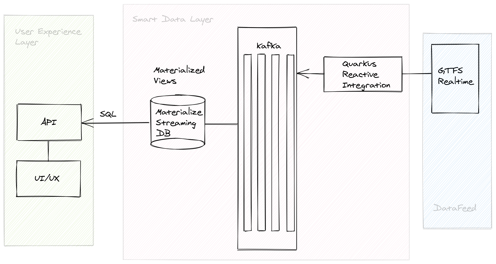
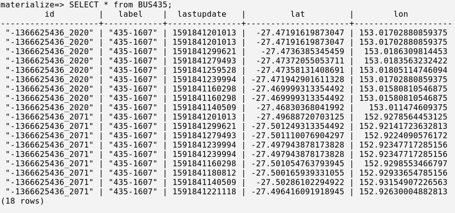

# gtfs bus positions into kafka+sse, timely data flow

- Retrieves Brisbane transport GTFS realtime data
- Uses Quarkus reactice app to store data in kafka
- Connects Materialize.io streaming database to kafka
- Browse data using SQL

Uses:

- [Kafka](https://strimzi.io)
- [Materalize](https://materialize.io)
- [Apicurio Schema Registry](https://github.com/Apicurio/apicurio-registry)

Requires:

- podman-compose (or docker-compose)
- jdk11, maven 3.6+





Run demo
```bash
# create materalize data directory
mkdir -p $HOME/mzdata 

# run infra locally (docker-compose should work also)
podman-compose up -d

# maven compile and run java app
mvn compile quarkus:dev

# browse kafka topic
kafkacat -b localhost:9092 -C -o end -q -u -t gtfs

# server side events available (for fun)
http http://localhost:8080/gtfs/stream --stream

# delete topic if you need to reset data (restart materaliaze container as well)
/opt/kafka_2.12-2.2.0/bin/kafka-topics.sh --zookeeper localhost:2181 --delete --topic gtfs

# build native mode locally
make podman-build

# run native locally
export QUARKUS_PROFILE=dev; 
./target/gtfs-sse-1.0-SNAPSHOT-runner
```

Demo UI
- Note: you need to modify and append an api key using `?key=<google maps api key>` in index.html to avoid google maps developer mode.
```bash
# browse to
http://localhost:8080/
```

TimelyDataFlow using materialize.io
```
# Schema load
psql -h localhost -p 6875 materialize -f ./load.sql

# Sechema drop
psql -h localhost -p 6875 materialize -f ./drop.sql

# Do it Manually:
psql -h localhost -p 6875 materialize

# create kafka source
CREATE SOURCE gtfs
FROM KAFKA BROKER 'localhost:9092' TOPIC 'gtfs'
FORMAT TEXT;

SHOW COLUMNS FROM gtfs;

# materialize all data
CREATE MATERIALIZED VIEW all_gtfs AS
    SELECT (text::JSONB)->>'id' as id,
           (text::JSONB)->>'vid' as vid,
           (text::JSONB)->>'label' as label,
           (text::JSONB)->'lastUpdate' as lastUpdate,
           CAST((text::JSONB)->'lat' as float) as lat,
           CAST((text::JSONB)->'lon' as float) as lon
    FROM (SELECT * FROM gtfs);

SELECT * from all_gtfs;
SHOW COLUMNS FROM all_gtfs;

# materalize only the 435 bus
CREATE MATERIALIZED VIEW ROUTE435 AS
    SELECT *
    FROM all_gtfs
    WHERE label = '435-1662';

SELECT * from ROUTE435;
SHOW COLUMNS FROM ROUTE435;

# clean up if required
DROP VIEW ROUTE435;
DROP VIEW all_gtfs;
DROP SOURCE gtfs;
```

From Google Maps browse current 435 Bus, and see vehicle id in materialize: 
```bash
SELECT * from ROUTE435 where vid = '-1366625436_2839';
```

Joining Some Streams
```bash
echo "label, name" > ~/mzdata/names.csv

CREATE SOURCE names_csv
FROM FILE '/work/mzdata/names.csv'
WITH ( tail=true )
FORMAT CSV WITH HEADER;

CREATE MATERIALIZED VIEW names AS
    SELECT *
    FROM names_csv;

SELECT * FROM names;

echo 435-1662, "Bus 435" >> ~/mzdata/names.csv
echo 444-1662, "Bus 444" >> ~/mzdata/names.csv
echo UQSL-1410, "Ferry UQSL" >> ~/mzdata/names.csv

DROP VIEW names;
DROP SOURCE names_csv;

--

CREATE MATERIALIZED VIEW ROUTE435 AS
    SELECT *
    FROM all_gtfs g, names n
    WHERE g.label = '435-1662'
    AND g.label = n.label;


CREATE MATERIALIZED VIEW ROUTE444 AS
    SELECT *
    FROM all_gtfs g, names n
    WHERE g.label = '444-1662'
    AND g.label = n.label;


CREATE MATERIALIZED VIEW ROUTEUQSL AS
    SELECT *
    FROM all_gtfs g, names n
    WHERE g.label = 'UQSL-1410'
    AND g.label = n.label;
```

Apicurio schema registry
```
http://localhost:8081/ui/artifacts
http://localhost:8081/api
```

### OpenShift

Requirements:
- deploy strimzi 0.18+ operator at cluster scope
- dynamic storage provisioning

```bash
oc new-project gtfs-sse
oc create -f opensfhift-deployment.yml
```

#### FIXME
- using text not avro, materalize cannot browse apicurio even in compat mode for avro schema 
